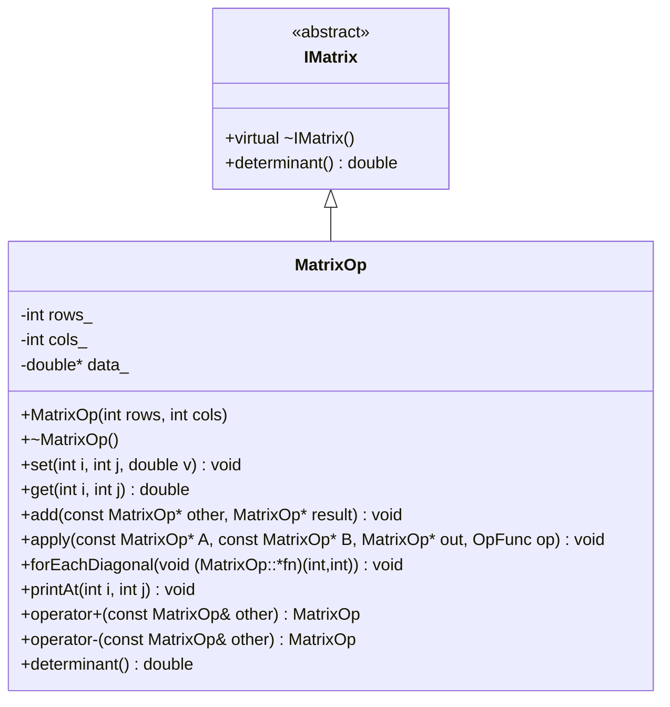

# Ejercicios de Apuntadores y Polimorfismo

## Sesión 4 — Demostración de habilidades: apuntadores y polimorfismo en C++

En esta actividad vas a desarrollar una clase llamada `MatrixOp` para practicar dos temas fundamentales de programación orientada a objetos en C++:

1. **Apuntadores**, memoria dinámica y recorrido de datos almacenados en arreglos.
2. **Polimorfismo**, mediante sobrecarga de operadores, funciones plantilla y herencia con métodos virtuales.

La intención de estos ejercicios no es solamente que el programa compile, sino que puedas demostrar que entiendes **qué hace cada instrucción clave**, por qué se usa y cómo se relaciona con los conceptos de la sesión.

---

## 1. Preparación del proyecto

Para el desarrollo de estos ejercicios se debe usar la estructura de proyecto indicada en el repositorio:

[Proyecto base disponible aquí](cpp_template_with_styles.zip)

Debes crear un repositorio llamado:

```text
Pointer_Polimorf
```

En ese repositorio desarrollarás todos los ejercicios de esta actividad.

---

## 2. Entregables esperados

Al finalizar, tu proyecto debe contener al menos los siguientes archivos:

```text
archivo.h
archivo.cpp
main.cpp
Testing_Ejercicio_no1.cpp      // Repetir para cada ejercicio
Salida_ejercicio_no1.cpp       // Repetir para cada ejercicio
```

> **Importante:** Si usas la estructura recomendada con carpetas, los nombres pueden organizarse como `MatrixOp.h`, `MatrixOp.cpp`, `main.cpp` y archivos de prueba dentro de `tests/`. Lo importante es que cada ejercicio tenga evidencia de implementación, prueba y salida.

---

## 3. Estructura obligatoria del proyecto

Tu proyecto debe organizarse de forma profesional. La estructura recomendada es:

```text
matrixOpProject/
├── include/
│   └── MatrixOp.h          ← Declaraciones de clases, métodos y funciones
├── src/
│   ├── MatrixOp.cpp        ← Implementaciones de los métodos
│   └── main.cpp            ← Programa principal de demostración
├── tests/
│   └── test_MatrixOp.cpp   ← Pruebas de humo o pruebas simples
├── .gitignore
└── README.md
```

### ¿Qué debe ir en cada archivo?

| Archivo | Contenido esperado |
|---|---|
| `include/MatrixOp.h` | Declaración de la clase `MatrixOp`, atributos, constructores, métodos, operadores y funciones auxiliares. |
| `src/MatrixOp.cpp` | Implementación de los métodos declarados en `MatrixOp.h`. |
| `src/main.cpp` | Ejemplos de uso para demostrar que cada ejercicio funciona. |
| `tests/test_MatrixOp.cpp` | Pruebas sencillas para comprobar que los métodos producen resultados correctos. |
| `README.md` | Explicación del proyecto, instrucciones de compilación, evidencias y diagrama final. |

---

## 4. Encabezado obligatorio en cada archivo

Cada archivo debe comenzar con un bloque de documentación estilo Doxygen:

```cpp
/**
 * @file NombreDelArchivo
 * @brief Breve descripción del contenido del archivo.
 * @date YYYY-MM-DD
 * @author Nombre del estudiante
 */
```

### ¿Para qué sirve este bloque?

Este encabezado ayuda a documentar el código profesionalmente. Permite identificar:

- Qué archivo se está revisando.
- Qué responsabilidad tiene el archivo.
- Quién lo desarrolló.
- En qué fecha se creó o actualizó.

---

# Bloque A: Apuntadores

En este bloque vas a construir la base de la clase `MatrixOp`. La matriz se almacenará internamente como un arreglo dinámico de valores `double`, administrado mediante un apuntador.

La idea central es representar una matriz de dos dimensiones usando un arreglo lineal de una sola dimensión.

Por ejemplo, una matriz de `2 x 3`:

```text
[ 1  2  3 ]
[ 4  5  6 ]
```

se puede guardar internamente como:

```text
data_ = [1, 2, 3, 4, 5, 6]
```

Para acceder al elemento `(i, j)`, se calcula el índice lineal:

```cpp
k = i * cols_ + j;
```

---

## Ejercicio A1 — Memoria dinámica y atributos básicos

### Objetivo

Implementar la clase base `MatrixOp` usando memoria dinámica. Este ejercicio demuestra que puedes crear, usar y liberar un arreglo dinámico mediante apuntadores.

---

## A1.1 Atributos de la clase

En la clase `MatrixOp` debes manejar los siguientes atributos:

```cpp
int rows_;
int cols_;
double *data_;
```

### ¿Qué representan `rows_` y `cols_`?

- `rows_` almacena el número de filas de la matriz.
- `cols_` almacena el número de columnas de la matriz.
- Ambos se usan para validar índices y evitar accesos inválidos.
- También permiten calcular cuántos datos se deben reservar en memoria.

Por ejemplo, si la matriz es de `3 x 4`, entonces:

```cpp
rows_ = 3;
cols_ = 4;
rows_ * cols_ = 12;
```

Eso significa que se necesita reservar memoria para `12` valores tipo `double`.

### ¿Qué representa `double *data_`?

`data_` es un apuntador a un arreglo dinámico de valores `double`.

```cpp
double *data_;
```

Este apuntador no almacena directamente toda la matriz. Lo que almacena es la dirección de memoria donde inicia el arreglo que contiene los elementos de la matriz.

Ejemplo conceptual:

```text
data_ ───► [ 1.0 ][ 2.0 ][ 3.0 ][ 4.0 ]
```

Para una matriz de `2 x 2`, el arreglo tendría `4` posiciones.

---

## A1.2 Constructor `MatrixOp(int rows, int cols)`

Debes implementar el constructor:

```cpp
MatrixOp(int rows, int cols);
```

### ¿Qué debe hacer?

1. Recibir el número de filas y columnas.
2. Validar que ambos valores sean mayores que cero.
3. Guardar esos valores en `rows_` y `cols_`.
4. Reservar memoria dinámica para `rows * cols` elementos.
5. Inicializar los elementos, preferentemente en `0.0`.

Ejemplo de reserva de memoria:

```cpp
data_ = new double[rows_ * cols_];
```

### Instrucción clave: `new double[rows_ * cols_]`

Esta instrucción solicita memoria dinámica para guardar un arreglo de `double`.

- `new` reserva memoria durante la ejecución del programa.
- `double[...]` indica que el arreglo será de valores decimales.
- `rows_ * cols_` indica cuántos elementos tendrá el arreglo.

### Riesgo importante

Cada vez que uses `new[]`, más adelante debes usar `delete[]`. Si no liberas la memoria, el programa puede provocar una fuga de memoria.

---

## A1.3 Destructor `~MatrixOp()`

Debes implementar el destructor:

```cpp
~MatrixOp();
```

### ¿Qué debe hacer?

Debe liberar la memoria dinámica que se reservó en el constructor:

```cpp
delete[] data_;
```

### Instrucción clave: `delete[] data_`

Esta instrucción libera el arreglo dinámico al que apunta `data_`.

- Se usa `delete[]` porque la memoria fue reservada con `new[]`.
- No se debe usar solo `delete`, porque eso sería incorrecto para arreglos.
- Después de liberar memoria, es buena práctica asignar `data_ = nullptr;`.

---

## A1.4 Método `set(int i, int j, double v)`

Debes implementar el setter:

```cpp
void set(int i, int j, double v);
```

### ¿Qué debe hacer?

Este método debe guardar el valor `v` en la posición `(i, j)` de la matriz.

Pasos esperados:

1. Validar que `i` esté entre `0` y `rows_ - 1`.
2. Validar que `j` esté entre `0` y `cols_ - 1`.
3. Calcular el índice lineal `k`.
4. Guardar `v` en `data_[k]`.

```cpp
int k = i * cols_ + j;
data_[k] = v;
```

### ¿Por qué se calcula `k = i * cols_ + j`?

Porque la matriz se guarda como arreglo lineal. El cálculo permite convertir una posición de dos dimensiones `(fila, columna)` en una posición de una dimensión.

Ejemplo en una matriz `2 x 3`:

```text
(i,j)      k
(0,0)  →   0
(0,1)  →   1
(0,2)  →   2
(1,0)  →   3
(1,1)  →   4
(1,2)  →   5
```

### Validación obligatoria

Si el índice es inválido, debes lanzar una excepción:

```cpp
throw std::out_of_range("Índice fuera de rango");
```

Esto evita que el programa intente acceder a memoria que no pertenece a la matriz.

---

## A1.5 Método `get(int i, int j) const`

Debes implementar el getter:

```cpp
double get(int i, int j) const;
```

### ¿Qué debe hacer?

Este método debe devolver el valor almacenado en la posición `(i, j)`.

Pasos esperados:

1. Validar los índices.
2. Calcular el índice lineal `k`.
3. Regresar `data_[k]`.

```cpp
int k = i * cols_ + j;
return data_[k];
```

### ¿Qué significa `const` al final?

El `const` indica que este método no debe modificar el estado interno del objeto. Es decir, puede leer la matriz, pero no debe cambiar sus valores.

---

## A1.6 Evidencia esperada

En `main.cpp`, crea una matriz, asigna valores y consulta algunos elementos:

```cpp
MatrixOp A(2, 2);
A.set(0, 0, 1.5);
A.set(0, 1, 2.5);
A.set(1, 0, 3.5);
A.set(1, 1, 4.5);

std::cout << A.get(0, 0) << std::endl;
std::cout << A.get(1, 1) << std::endl;
```

Salida esperada aproximada:

```text
1.5
4.5
```

---

## Ejercicio A2 — Suma de matrices por puntero

### Objetivo

Implementar una operación de suma usando apuntadores a objetos. Este ejercicio demuestra que entiendes cómo pasar objetos por dirección y cómo acceder a sus miembros mediante `->`.

---

## A2.1 Método a declarar

En la clase `MatrixOp`, declara:

```cpp
void add(const MatrixOp *other, MatrixOp *result) const;
```

---

## A2.2 ¿Qué significa cada parámetro?

```cpp
const MatrixOp *other
```

- Es un apuntador a otra matriz.
- Tiene `const`, por lo tanto `add` no debe modificar esa matriz.
- Se usará como segundo operando de la suma.

```cpp
MatrixOp *result
```

- Es un apuntador a una matriz donde se guardará el resultado.
- No tiene `const`, porque sí se modificará.
- Debe tener las mismas dimensiones que las matrices que se están sumando.

```cpp
const
```

El `const` al final del método significa que el objeto que llama a `add` tampoco debe modificarse.

---

## A2.3 ¿Qué operación debe realizar?

Si tienes:

```cpp
A.add(&B, &C);
```

entonces debes interpretar la instrucción como:

```text
C = A + B
```

donde:

- `A` es el objeto actual, es decir, `this`.
- `B` es `other`.
- `C` es `result`.

---

## A2.4 Validaciones obligatorias

Antes de sumar, debes comprobar que:

1. `other` no sea `nullptr`.
2. `result` no sea `nullptr`.
3. `this` y `other` tengan las mismas dimensiones.
4. `result` tenga las mismas dimensiones que `this`.

Si algo no es válido, lanza una excepción adecuada, por ejemplo:

```cpp
throw std::invalid_argument("Dimensiones incompatibles");
```

o:

```cpp
throw std::invalid_argument("Puntero nulo recibido");
```

---

## A2.5 Implementación esperada

Recorre todos los elementos usando un índice lineal `k`:

```cpp
for (int k = 0; k < rows_ * cols_; ++k) {
    result->data_[k] = this->data_[k] + other->data_[k];
}
```

### Instrucciones clave

| Instrucción | Significado |
|---|---|
| `this->data_[k]` | Accede al dato `k` de la matriz que llama al método. |
| `other->data_[k]` | Accede al dato `k` de la matriz apuntada por `other`. |
| `result->data_[k]` | Escribe el resultado en la matriz apuntada por `result`. |
| `->` | Se usa para acceder a miembros desde un apuntador. |

---

## A2.6 Uso en `main.cpp`

```cpp
MatrixOp A(2, 2);
MatrixOp B(2, 2);
MatrixOp C(2, 2);

// Inicializar A y B con valores

A.add(&B, &C);

std::cout << "C[0,0] = " << C.get(0,0) << std::endl;
```

### ¿Por qué se usa `&B` y `&C`?

Porque el método espera apuntadores. El operador `&` obtiene la dirección de memoria de un objeto.

```cpp
&B   // dirección del objeto B
&C   // dirección del objeto C
```

---

## Ejercicio A3 — Aplicar operaciones genéricas con punteros a función

### Objetivo

Implementar una función que reciba otra función como parámetro. Esto permite aplicar distintas operaciones sobre matrices sin reescribir todo el recorrido.

Este ejercicio es importante porque introduce una idea central de diseño: **separar el recorrido de los datos de la operación que se aplica sobre ellos**.

---

## A3.1 Declaración en `MatrixOp.h`

Declara el alias para un puntero a función:

```cpp
using OpFunc = double(*)(double, double);
```

Después declara el método:

```cpp
void apply(const MatrixOp *A,
           const MatrixOp *B,
           MatrixOp *out,
           OpFunc op) const;
```

---

## A3.2 ¿Qué significa `OpFunc`?

```cpp
using OpFunc = double(*)(double, double);
```

Esta línea define un nuevo nombre llamado `OpFunc`.

Un `OpFunc` representa un apuntador a una función que:

- Recibe dos valores `double`.
- Devuelve un valor `double`.

Por ejemplo, esta función cumple con esa firma:

```cpp
double sub(double a, double b) {
    return a - b;
}
```

También esta:

```cpp
double mul(double a, double b) {
    return a * b;
}
```

Ambas pueden pasarse como argumento al método `apply`.

---

## A3.3 ¿Qué debe hacer `apply`?

Debe recorrer elemento por elemento las matrices `A` y `B`, aplicar la operación `op` y guardar el resultado en `out`.

La instrucción central es:

```cpp
out->data_[k] = op(A->data_[k], B->data_[k]);
```

### Lectura de la instrucción

Esta línea se puede leer así:

> “Toma el elemento `k` de `A`, toma el elemento `k` de `B`, aplica la función `op` a ambos valores y guarda el resultado en la posición `k` de `out`.”

Si `op` es `sub`, entonces hará resta.

Si `op` es `mul`, entonces hará multiplicación.

---

## A3.4 Validaciones obligatorias

Antes de operar, comprueba que:

1. `A`, `B`, `out` y `op` no sean nulos.
2. `A` y `B` tengan las mismas dimensiones.
3. `out` tenga las mismas dimensiones que `A`.

Si no se cumple, lanza una excepción.

---

## A3.5 Funciones auxiliares requeridas

Implementa estas funciones auxiliares:

```cpp
double sub(double a, double b);
double mul(double a, double b);
```

Con la siguiente lógica:

```cpp
double sub(double a, double b) {
    return a - b;
}

double mul(double a, double b) {
    return a * b;
}
```

---

## A3.6 Uso en `main.cpp`

```cpp
MatrixOp A(2, 2);
MatrixOp B(2, 2);
MatrixOp C(2, 2);
MatrixOp D(2, 2);

// Inicializar A y B con valores

A.apply(&A, &B, &C, sub);
A.apply(&A, &B, &D, mul);
```

Luego imprime `C` y `D` para demostrar que:

```text
C = A - B
D = A * B elemento a elemento
```

> Nota: La multiplicación solicitada en este ejercicio es elemento a elemento, no multiplicación matricial tradicional.

---

## Ejercicio A4 — Recorrido con puntero a miembro

### Objetivo

Implementar una función que recorra la diagonal principal de la matriz y ejecute un método de la propia clase en cada posición diagonal.

Este ejercicio demuestra una forma más avanzada de apuntadores: **punteros a métodos miembro**.

---

## A4.1 Declaraciones en `MatrixOp.h`

Declara los métodos:

```cpp
void forEachDiagonal(void (MatrixOp::*fn)(int i, int j)) const;
void printAt(int i, int j) const;
```

---

## A4.2 ¿Qué significa `void (MatrixOp::*fn)(int i, int j)`?

Esta sintaxis representa un apuntador a un método miembro de la clase `MatrixOp`.

El método apuntado debe cumplir estas condiciones:

- Pertenecer a `MatrixOp`.
- Devolver `void`.
- Recibir dos enteros: `int i`, `int j`.

En este caso, el método que se pasará será:

```cpp
&MatrixOp::printAt
```

---

## A4.3 Método `printAt(int i, int j) const`

Este método debe imprimir el valor almacenado en la posición `(i, j)`:

```cpp
std::cout << get(i, j) << " ";
```

Debe usar `get(i, j)` para aprovechar las validaciones ya implementadas.

---

## A4.4 Método `forEachDiagonal`

El método debe recorrer la diagonal principal.

La diagonal principal está formada por posiciones donde la fila y la columna son iguales:

```text
(0,0), (1,1), (2,2), ...
```

En una matriz de `3 x 3`:

```text
[ x  .  . ]
[ .  x  . ]
[ .  .  x ]
```

En una matriz no cuadrada, por ejemplo `2 x 3`, la diagonal principal posible sería:

```text
(0,0), (1,1)
```

Por eso se debe iterar hasta:

```cpp
std::min(rows_, cols_)
```

La llamada al método miembro se hace así:

```cpp
(this->*fn)(i, i);
```

### Lectura de la instrucción

```cpp
(this->*fn)(i, i);
```

significa:

> “Sobre este objeto (`this`), ejecuta el método apuntado por `fn`, enviándole como argumentos la posición `(i, i)`.”

---

## A4.5 Uso en `main.cpp`

```cpp
MatrixOp M(3, 3);

// Inicializar M con valores

M.forEachDiagonal(&MatrixOp::printAt);
```

Salida esperada aproximada:

```text
1 5 9
```

si la matriz contiene:

```text
[ 1 2 3 ]
[ 4 5 6 ]
[ 7 8 9 ]
```

---

# Bloque B: Polimorfismo

En este bloque vas a practicar tres formas de polimorfismo en C++:

1. **Sobrecarga de operadores**: permite que operadores como `+` o `-` funcionen con objetos propios.
2. **Funciones plantilla**: permiten escribir una función genérica que trabaja con distintos tipos de datos.
3. **Herencia con métodos virtuales**: permite usar una clase base para llamar métodos implementados en clases derivadas.

---

## Ejercicio B1 — Sobrecarga de operadores

### Objetivo

Permitir usar expresiones naturales con matrices:

```cpp
MatrixOp C = A + B;
MatrixOp D = A - B;
```

Esto significa que los objetos de la clase `MatrixOp` podrán comportarse de manera parecida a tipos básicos como `int` o `double`, pero con operaciones definidas por ti.

---

## B1.1 Declaración en `include/MatrixOp.h`

Dentro de la clase `MatrixOp`, añade en la sección `public`:

```cpp
MatrixOp operator+(const MatrixOp &other) const;
MatrixOp operator-(const MatrixOp &other) const;
```

---

## B1.2 ¿Qué significa cada parte?

```cpp
MatrixOp operator+(const MatrixOp &other) const;
```

| Parte | Significado |
|---|---|
| `MatrixOp` | El operador devuelve una nueva matriz. |
| `operator+` | Se está redefiniendo el comportamiento del operador `+`. |
| `const MatrixOp &other` | La segunda matriz se recibe por referencia constante. |
| `const` final | La matriz que llama al operador no debe modificarse. |

La expresión:

```cpp
MatrixOp C = A + B;
```

equivale conceptualmente a:

```cpp
MatrixOp C = A.operator+(B);
```

---

## B1.3 Implementación esperada en `src/MatrixOp.cpp`

Cada operador debe:

1. Validar que ambas matrices tengan las mismas dimensiones.
2. Crear una matriz resultado.
3. Recorrer los elementos con un índice lineal.
4. Guardar en el resultado la suma o resta elemento a elemento.
5. Devolver el resultado por valor.

Para suma:

```cpp
MatrixOp result(rows_, cols_);

for (int k = 0; k < rows_ * cols_; ++k) {
    result.data_[k] = this->data_[k] + other.data_[k];
}

return result;
```

Para resta:

```cpp
MatrixOp result(rows_, cols_);

for (int k = 0; k < rows_ * cols_; ++k) {
    result.data_[k] = this->data_[k] - other.data_[k];
}

return result;
```

---

## B1.4 Validación obligatoria

Si las matrices no tienen las mismas dimensiones, lanza:

```cpp
throw std::invalid_argument("Dimensiones incompatibles");
```

---

## B1.5 Uso en `src/main.cpp`

```cpp
MatrixOp A(2, 2);
MatrixOp B(2, 2);

// Inicializa A y B con valores

MatrixOp C = A + B;
MatrixOp D = A - B;

std::cout << "C[0,0] = " << C.get(0,0) << "\n";
std::cout << "D[1,1] = " << D.get(1,1) << "\n";
```

Salida esperada, según los valores que asignes:

```text
C[0,0] = 3.0
D[1,1] = -1.0
```

---

## B1.6 Error común a evitar

No debes modificar `A` ni `B` dentro de `operator+` o `operator-`. Estos operadores deben crear una nueva matriz resultado.

Correcto:

```cpp
MatrixOp C = A + B;
```

Incorrecto si modifica internamente a `A` sin que el usuario lo espere.

---

## Ejercicio B2 — Función plantilla genérica

### Objetivo

Implementar una función genérica `maxValue<T>()` que reciba un arreglo y devuelva el valor máximo.

Este ejercicio representa **polimorfismo en tiempo de compilación**, porque la misma función puede adaptarse a distintos tipos de datos como `int`, `double` o `float`.

---

## B2.1 Declaración en `include/MatrixOp.h`

La función debe declararse fuera de la clase:

```cpp
template<typename T>
T maxValue(const T *arr, int n);
```

---

## B2.2 ¿Qué significa `template<typename T>`?

```cpp
template<typename T>
```

significa que la función trabajará con un tipo genérico llamado `T`.

Cuando se use la función, `T` puede convertirse en:

```cpp
int
float
double
```

Por ejemplo:

```cpp
int maxInt = maxValue<int>(arrInt, 5);
double maxDouble = maxValue<double>(arrDouble, 5);
```

---

## B2.3 ¿Qué significan los parámetros?

```cpp
const T *arr
```

- Es un apuntador al primer elemento de un arreglo.
- Tiene `const` porque la función no debe modificar el arreglo.

```cpp
int n
```

- Es el número de elementos del arreglo.
- Debe ser mayor que cero.

---

## B2.4 Implementación esperada

La función debe:

1. Validar que `arr` no sea `nullptr`.
2. Validar que `n > 0`.
3. Tomar el primer elemento como máximo inicial.
4. Recorrer el arreglo desde el segundo elemento.
5. Actualizar el máximo si encuentra un valor mayor.
6. Devolver el máximo.

Ejemplo:

```cpp
template<typename T>
T maxValue(const T *arr, int n) {
    if (arr == nullptr) {
        throw std::invalid_argument("Arreglo nulo");
    }

    if (n <= 0) {
        throw std::invalid_argument("Tamaño inválido");
    }

    T maxVal = arr[0];

    for (int i = 1; i < n; ++i) {
        if (arr[i] > maxVal) {
            maxVal = arr[i];
        }
    }

    return maxVal;
}
```

---

## B2.5 ¿Dónde colocar la implementación?

Como es una función plantilla, la implementación debe estar disponible en el archivo de encabezado.

Puedes colocarla:

1. Al final de `MatrixOp.h`, o
2. En un archivo `MatrixOp.hpp` incluido desde `MatrixOp.h`.

Para este curso, la opción más simple es colocarla al final de `MatrixOp.h`.

---

## B2.6 Acceso a los datos de `MatrixOp`

El ejercicio original propone usar el arreglo interno de la matriz. Si `data_` está declarado como `private`, no debes acceder directamente a `M.data_` desde `main.cpp`.

La forma recomendada es agregar métodos públicos de solo lectura:

```cpp
const double* data() const {
    return data_;
}

int size() const {
    return rows_ * cols_;
}
```

Con esto puedes llamar:

```cpp
double maxElem = maxValue<double>(M.data(), M.size());
```

Esta solución mantiene el encapsulamiento de la clase.

---

## B2.7 Uso en `src/main.cpp`

```cpp
MatrixOp M(3, 3);

// Inicializar M con valores diversos

double maxElem = maxValue<double>(M.data(), M.size());

std::cout << "Máximo elemento de M: " << maxElem << "\n";
```

Salida esperada aproximada:

```text
Máximo elemento de M: 42.5
```

---

## Ejercicio B3 — Herencia y métodos virtuales

### Objetivo

Crear una interfaz `IMatrix` con un método virtual puro llamado `determinant()` e implementar ese método en `MatrixOp`.

Este ejercicio introduce polimorfismo en tiempo de ejecución: una variable de tipo base puede apuntar a un objeto de una clase derivada y ejecutar el método correcto.

---

## B3.1 Declaración de la interfaz `IMatrix`

Antes de la definición de `MatrixOp`, agrega:

```cpp
class IMatrix {
public:
    virtual ~IMatrix() = default;
    virtual double determinant() const = 0;
};
```

---

## B3.2 ¿Qué es una interfaz?

En C++, una interfaz suele representarse como una clase abstracta que define métodos que otras clases deben implementar.

En este caso:

```cpp
virtual double determinant() const = 0;
```

significa:

> “Toda clase que herede de `IMatrix` debe implementar un método para calcular el determinante.”

---

## B3.3 ¿Qué significa `virtual`?

La palabra `virtual` permite que C++ decida en tiempo de ejecución qué versión del método debe llamar.

Esto es clave para el polimorfismo.

Por ejemplo:

```cpp
IMatrix *mat = new MatrixOp(2, 2);
mat->determinant();
```

Aunque el apuntador es de tipo `IMatrix*`, el objeto real es de tipo `MatrixOp`. Gracias a `virtual`, C++ llamará a:

```cpp
MatrixOp::determinant()
```

---

## B3.4 ¿Qué significa `= 0`?

La parte `= 0` indica que el método es **virtual puro**.

```cpp
virtual double determinant() const = 0;
```

Esto significa que `IMatrix` no puede crear objetos directamente.

Incorrecto:

```cpp
IMatrix obj; // No se puede instanciar una clase abstracta
```

Correcto:

```cpp
IMatrix *mat = new MatrixOp(2, 2);
```

---

## B3.5 ¿Por qué el destructor también es `virtual`?

```cpp
virtual ~IMatrix() = default;
```

Si vas a borrar un objeto derivado usando un apuntador a clase base, el destructor de la clase base debe ser virtual.

Ejemplo:

```cpp
IMatrix *mat = new MatrixOp(2, 2);
delete mat;
```

Con destructor virtual, C++ libera correctamente el objeto real `MatrixOp`.

Sin destructor virtual, podrías provocar liberación incompleta de recursos.

---

## B3.6 Modificación de la clase `MatrixOp`

La clase `MatrixOp` debe heredar de `IMatrix`:

```cpp
class MatrixOp : public IMatrix {
public:
    double determinant() const override;
};
```

---

## B3.7 ¿Qué significa `public IMatrix`?

```cpp
class MatrixOp : public IMatrix
```

significa que `MatrixOp` hereda públicamente de `IMatrix`.

Con esto, un objeto `MatrixOp` también puede tratarse como un `IMatrix`.

---

## B3.8 ¿Qué significa `override`?

```cpp
double determinant() const override;
```

`override` indica que este método está sobrescribiendo un método virtual heredado.

Su ventaja es que el compilador puede detectar errores. Por ejemplo, si escribes mal el nombre o cambias la firma del método, el compilador avisará.

---

## B3.9 Implementación de `determinant()`

### Caso 2 x 2

Para una matriz:

```text
| a  b |
| c  d |
```

el determinante es:

```text
a*d - b*c
```

Implementación:

```cpp
return get(0,0) * get(1,1) - get(0,1) * get(1,0);
```

---

### Caso 3 x 3

Para una matriz:

```text
| a  b  c |
| d  e  f |
| g  h  i |
```

puedes usar la regla de Sarrus:

```text
(a*e*i + b*f*g + c*d*h) - (c*e*g + b*d*i + a*f*h)
```

---

### Otros tamaños

Para matrices distintas de `2 x 2` o `3 x 3`, lanza:

```cpp
throw std::logic_error("Implementar para 2x2 o 3x3");
```

---

## B3.10 Uso en `src/main.cpp`

```cpp
IMatrix *mat = new MatrixOp(2, 2);
```

Esta línea crea un objeto `MatrixOp`, pero lo guarda en un apuntador de tipo `IMatrix*`.

### Punto importante

Como `mat` es de tipo `IMatrix*`, solo puedes llamar directamente a métodos definidos en `IMatrix`, por ejemplo:

```cpp
mat->determinant();
```

Pero no puedes llamar directamente a `set()` si `set()` no existe en `IMatrix`.

Por eso, para asignar valores, tienes dos opciones:

### Opción 1: usar un objeto `MatrixOp` y luego apuntarlo como `IMatrix*`

```cpp
MatrixOp M(2, 2);
M.set(0, 0, 1);
M.set(0, 1, 2);
M.set(1, 0, 3);
M.set(1, 1, 4);

IMatrix *mat = &M;
std::cout << "Determinante: " << mat->determinant() << "\n";
```

Esta opción es más simple para el ejercicio.

### Opción 2: crear con `new` y convertir temporalmente

```cpp
IMatrix *mat = new MatrixOp(2, 2);
MatrixOp *realMat = dynamic_cast<MatrixOp*>(mat);

if (realMat != nullptr) {
    realMat->set(0, 0, 1);
    realMat->set(0, 1, 2);
    realMat->set(1, 0, 3);
    realMat->set(1, 1, 4);
}

std::cout << "Determinante: " << mat->determinant() << "\n";

delete mat;
```

Para alumnos que están comenzando, se recomienda la **opción 1**, porque evita complejidad innecesaria.

---

## B3.11 Salida esperada

Si la matriz es:

```text
| 1  2 |
| 3  4 |
```

el determinante es:

```text
1*4 - 2*3 = 4 - 6 = -2
```

Salida esperada:

```text
Determinante: -2
```

---

# Ejercicio final — Diagrama de clases

Al terminar los ejercicios, debes generar un diagrama de clases en Mermaid o UML que muestre la estructura resultante de tu solución.

El diagrama debe incluir:

1. La clase abstracta o interfaz `IMatrix`.
2. La clase concreta `MatrixOp`.
3. La relación de herencia entre `IMatrix` y `MatrixOp`.
4. Los métodos virtuales y sobrescritos.
5. Los operadores sobrecargados en `MatrixOp`.
6. Las relaciones de uso con:
   - Punteros a función.
   - Punteros a miembro.

---

## Ejemplo de diagrama Mermaid

Puedes usar este ejemplo como punto de partida y ajustarlo a tu implementación final:



---

# Pruebas mínimas recomendadas

Después de cada ejercicio, ejecuta una prueba de humo. Una prueba de humo es una prueba sencilla para verificar que la funcionalidad básica trabaja correctamente.

## Checklist de pruebas

| Ejercicio | Prueba mínima |
|---|---|
| A1 | Crear matriz, asignar valores con `set()` y leerlos con `get()`. |
| A2 | Sumar dos matrices y comprobar al menos dos posiciones del resultado. |
| A3 | Aplicar `sub` y `mul` sobre dos matrices y mostrar los resultados. |
| A4 | Imprimir la diagonal principal de una matriz conocida. |
| B1 | Usar `A + B` y `A - B` y validar resultados. |
| B2 | Usar `maxValue<double>()` sobre los datos de una matriz. |
| B3 | Calcular determinante de matriz `2 x 2` y comprobar el resultado esperado. |

---

# Recomendaciones finales

1. Implementa un ejercicio a la vez.
2. Compila después de cada avance pequeño.
3. No avances al siguiente ejercicio si el anterior no compila.
4. Usa mensajes de error claros con excepciones.
5. Mantén los atributos privados siempre que sea posible.
6. Documenta tus decisiones en el README de tu repositorio.
7. Agrega capturas o archivos de salida como evidencia de ejecución.
8. Publica el diagrama final en el `README.md` de tu solución `Pointer_Polimorf`.

---

# Criterios de logro

Al finalizar esta actividad, debes poder explicar:

- Qué es un apuntador y cómo se usa para administrar memoria dinámica.
- Por qué se necesita un destructor cuando se usa `new[]`.
- Cómo se convierte una posición `(i, j)` en un índice lineal `k`.
- Cómo pasar objetos por apuntador.
- Qué es un puntero a función.
- Qué es un puntero a método miembro.
- Qué significa sobrecargar un operador.
- Qué significa `template<typename T>`.
- Qué significa `virtual`.
- Qué significa un método virtual puro `= 0`.
- Qué significa `override`.
- Por qué una clase abstracta permite diseñar código más flexible.
